# Gateway API Topology

```mermaid
graph TB
    %% GatewayClass (cluster-scoped)
    GC_ocp["GatewayClass: ocp-default<br/>Controller: openshift.io/gateway-controller<br/>Status: Unknown"]

    %% ==========================================================================
    %% Gateway 1: api-gateway
    %% ==========================================================================
    subgraph gw1["Gateway: api-gateway (gateway-demo)"]
        direction TB

        subgraph listeners1["Listeners"]
            L1_http["HTTP:80<br/>(http)"]
            L1_https["HTTPS:443<br/>(https)"]
        end

        subgraph routes1["Attached Routes"]
            HR1_health["HTTPRoute: api-health-route"]
            HR1_v1["HTTPRoute: api-v1-route"]
            HR1_v2["HTTPRoute: api-v2-route"]
        end

        subgraph rules1["Routing Rules"]
            R1_health["Rule: Exact:/health"]
            R1_v1["Rule: PathPrefix:/api/v1<br/>Headers: x-api-version=v1"]
            R1_v2["Rule: PathPrefix:/api/v2"]
        end

        subgraph backends1["Backends"]
            SVC1_health["health-svc:8080"]
            SVC1_v1["api-v1-svc:8080"]
            SVC1_v2["api-v2-svc:8080<br/>Weight: 80%"]
            SVC1_v2_canary["api-v2-canary-svc:8080<br/>Weight: 20%"]
        end

        subgraph pods1["Endpoints"]
            POD1_health["health-5f84bd8dc4-k28s5<br/>10.132.0.45 ready"]
            POD1_v1a["api-v1-6fbb4ddcf4-9rndt<br/>10.132.0.40 ready"]
            POD1_v1b["api-v1-6fbb4ddcf4-z8f7d<br/>10.132.0.41 ready"]
            POD1_v2a["api-v2-6bc4f7b6d9-qnmpv<br/>10.132.0.43 ready"]
            POD1_v2b["api-v2-6bc4f7b6d9-v6nhr<br/>10.132.0.42 ready"]
            POD1_canary["api-v2-canary-76f4bcfd94-8l6bm<br/>10.132.0.44 ready"]
        end

        %% Connections within api-gateway
        L1_http --> HR1_health
        L1_http --> HR1_v1
        L1_http --> HR1_v2
        HR1_health --> R1_health
        HR1_v1 --> R1_v1
        HR1_v2 --> R1_v2
        R1_health --> SVC1_health
        R1_v1 --> SVC1_v1
        R1_v2 -->|80%| SVC1_v2
        R1_v2 -->|20%| SVC1_v2_canary
        SVC1_health --> POD1_health
        SVC1_v1 --> POD1_v1a
        SVC1_v1 --> POD1_v1b
        SVC1_v2 --> POD1_v2a
        SVC1_v2 --> POD1_v2b
        SVC1_v2_canary --> POD1_canary
    end

    %% ==========================================================================
    %% Gateway 2: web-gateway
    %% ==========================================================================
    subgraph gw2["Gateway: web-gateway (gateway-demo)"]
        direction TB

        subgraph listeners2["Listeners"]
            L2_http["HTTP:80<br/>(http)"]
        end

        subgraph routes2["Attached Routes"]
            HR2_web["HTTPRoute: web-route<br/>Host: www.example.com"]
            HR2_static["HTTPRoute: static-route<br/>Host: www.example.com"]
        end

        subgraph rules2["Routing Rules"]
            R2_web["Rule: PathPrefix:/"]
            R2_static["Rule: PathPrefix:/static"]
        end

        subgraph backends2["Backends"]
            SVC2_web["web-frontend-svc:80"]
            SVC2_static["static-assets-svc:80"]
        end

        subgraph pods2["Endpoints"]
            POD2_weba["web-frontend-5569b5dc57-s9ttj<br/>10.132.0.47 ready"]
            POD2_webb["web-frontend-5569b5dc57-slhd6<br/>10.132.0.46 ready"]
            POD2_static["static-assets-758dc746d8-wt77t<br/>10.132.0.48 ready"]
        end

        %% Connections within web-gateway
        L2_http --> HR2_web
        L2_http --> HR2_static
        HR2_web --> R2_web
        HR2_static --> R2_static
        R2_web --> SVC2_web
        R2_static --> SVC2_static
        SVC2_web --> POD2_weba
        SVC2_web --> POD2_webb
        SVC2_static --> POD2_static
    end

    %% ==========================================================================
    %% Gateway 3: internal-gateway
    %% ==========================================================================
    subgraph gw3["Gateway: internal-gateway (gateway-demo)"]
        direction TB

        subgraph listeners3["Listeners"]
            L3_http["HTTP:8080<br/>(internal)"]
        end

        subgraph routes3["Attached Routes"]
            HR3_internal["HTTPRoute: internal-route"]
        end

        subgraph rules3["Routing Rules"]
            R3_internal["Rule: PathPrefix:/internal"]
        end

        subgraph backends3["Backends (cross-namespace)"]
            SVC3_shared["shared-backend-svc:8080<br/>(backend-services)"]
        end

        subgraph pods3["Endpoints"]
            POD3_a["shared-backend-6fbffd4d6d-fr946<br/>10.132.0.49 ready"]
            POD3_b["shared-backend-6fbffd4d6d-cvpw2<br/>10.132.0.50 ready"]
        end

        %% Connections within internal-gateway
        L3_http --> HR3_internal
        HR3_internal --> R3_internal
        R3_internal -.->|cross-namespace| SVC3_shared
        SVC3_shared --> POD3_a
        SVC3_shared --> POD3_b
    end

    %% ==========================================================================
    %% ReferenceGrant
    %% ==========================================================================
    RG["ReferenceGrant: allow-gateway-demo<br/>(backend-services)<br/>Allows: HTTPRoute(gateway-demo) → Service"]

    %% GatewayClass to Gateway connections
    GC_ocp --> gw1
    GC_ocp --> gw2
    GC_ocp --> gw3

    %% ReferenceGrant connection
    RG -.-> SVC3_shared

    %% ==========================================================================
    %% Styles
    %% ==========================================================================
    classDef gatewayclass fill:#e8f5e9,stroke:#2e7d32,stroke-width:2px,color:#000
    classDef listener fill:#e3f2fd,stroke:#1565c0,stroke-width:2px,color:#000
    classDef route fill:#fff3e0,stroke:#e65100,stroke-width:2px,color:#000
    classDef rule fill:#fce4ec,stroke:#c2185b,stroke-width:1px,color:#000
    classDef service fill:#f3e5f5,stroke:#6a1b9a,stroke-width:2px,color:#000
    classDef pod fill:#fff9c4,stroke:#f57f17,stroke-width:1px,color:#000
    classDef refgrant fill:#e0f2f1,stroke:#00695c,stroke-width:2px,color:#000,stroke-dasharray: 5 5

    class GC_ocp gatewayclass
    class L1_http,L1_https,L2_http,L3_http listener
    class HR1_health,HR1_v1,HR1_v2,HR2_web,HR2_static,HR3_internal route
    class R1_health,R1_v1,R1_v2,R2_web,R2_static,R3_internal rule
    class SVC1_health,SVC1_v1,SVC1_v2,SVC1_v2_canary,SVC2_web,SVC2_static,SVC3_shared service
    class POD1_health,POD1_v1a,POD1_v1b,POD1_v2a,POD1_v2b,POD1_canary,POD2_weba,POD2_webb,POD2_static,POD3_a,POD3_b pod
    class RG refgrant

    %% Subgraph Styling
    style listeners1 fill:#e1f5fe,stroke:#0277bd,stroke-width:2px
    style routes1 fill:#fff8e1,stroke:#ff8f00,stroke-width:2px
    style rules1 fill:#fce4ec,stroke:#c2185b,stroke-width:1px,stroke-dasharray: 3 3
    style backends1 fill:#f3e5f5,stroke:#7b1fa2,stroke-width:2px
    style pods1 fill:#fffde7,stroke:#fbc02d,stroke-width:1px,stroke-dasharray: 3 3

    style listeners2 fill:#e1f5fe,stroke:#0277bd,stroke-width:2px
    style routes2 fill:#fff8e1,stroke:#ff8f00,stroke-width:2px
    style rules2 fill:#fce4ec,stroke:#c2185b,stroke-width:1px,stroke-dasharray: 3 3
    style backends2 fill:#f3e5f5,stroke:#7b1fa2,stroke-width:2px
    style pods2 fill:#fffde7,stroke:#fbc02d,stroke-width:1px,stroke-dasharray: 3 3

    style listeners3 fill:#e1f5fe,stroke:#0277bd,stroke-width:2px
    style routes3 fill:#fff8e1,stroke:#ff8f00,stroke-width:2px
    style rules3 fill:#fce4ec,stroke:#c2185b,stroke-width:1px,stroke-dasharray: 3 3
    style backends3 fill:#f3e5f5,stroke:#7b1fa2,stroke-width:2px
    style pods3 fill:#fffde7,stroke:#fbc02d,stroke-width:1px,stroke-dasharray: 3 3
```

## Summary

| Resource Type | Count | Details |
|--------------|-------|---------|
| GatewayClass | 1 | ocp-default |
| Gateways | 3 | api-gateway, web-gateway, internal-gateway |
| HTTPRoutes | 6 | With path/header matching |
| Backend Services | 7 | Including cross-namespace |
| Pod Endpoints | 11 | All ready |
| ReferenceGrants | 1 | allow-gateway-demo |

### Key Features Shown

- **Canary Traffic Split**: api-v2-route sends 80% to api-v2-svc, 20% to api-v2-canary-svc
- **Header Matching**: api-v1-route requires `x-api-version: v1` header
- **Cross-Namespace Reference**: internal-route references shared-backend-svc in backend-services namespace (dashed line)
- **ReferenceGrant**: Permits gateway-demo HTTPRoutes to reference backend-services Services

### Legend

| Color | Resource Type |
|-------|--------------|
| Green | GatewayClass |
| Blue | Listeners |
| Orange | HTTPRoutes |
| Pink | Routing Rules |
| Purple | Backend Services |
| Yellow | Pod Endpoints |
| Teal (dashed) | ReferenceGrant |
