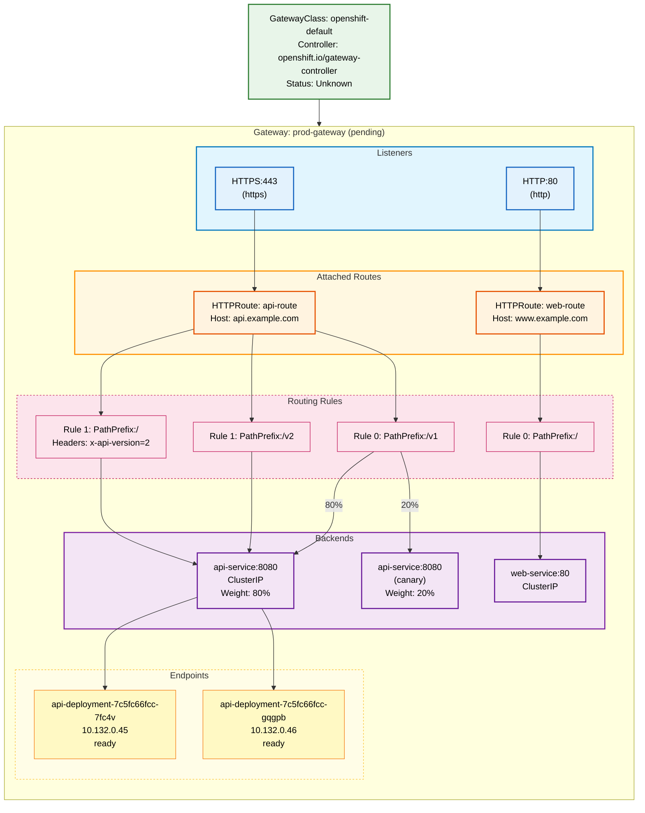

# Gateway API Topology

## Summary

| Resource Type | Count |
|---------------|-------|
| GatewayClasses | 1 |
| Gateways | 1 |
| HTTPRoutes | 2 |
| GRPCRoutes | 0 |
| TCPRoutes | 0 |
| TLSRoutes | 0 |
| Route Rules | 4 |
| Backend Services | 2 |
| Pod Endpoints | 2 |
| ReferenceGrants | 0 |

## Status

**Gateway API CRDs Installed:** Yes (5 CRDs)
- gateways.gateway.networking.k8s.io
- gatewayclasses.gateway.networking.k8s.io
- httproutes.gateway.networking.k8s.io
- grpcroutes.gateway.networking.k8s.io
- referencegrants.gateway.networking.k8s.io

**gwctl Available:** Yes

## Topology Diagram

## Traffic Flow

### API Traffic (api.example.com)
1. **Listener:** HTTPS:443 (https)
2. **Route:** api-route
3. **Rules:**
   - PathPrefix:/v1 → api-service (80% main, 20% canary)
   - PathPrefix:/v2 → api-service
   - PathPrefix:/ with header x-api-version=2 → api-service
4. **Endpoints:**
   - api-deployment-7c5fc66fcc-7fc4v (10.132.0.45) - ready
   - api-deployment-7c5fc66fcc-gqgpb (10.132.0.46) - ready

### Web Traffic (www.example.com)
1. **Listener:** HTTP:80 (http)
2. **Route:** web-route
3. **Rules:**
   - PathPrefix:/ → web-service
4. **Endpoints:** None (0 pods)

## Resource Details

### GatewayClass: openshift-default
- **Controller:** openshift.io/gateway-controller
- **Status:** Unknown

### Gateway: default/prod-gateway
- **GatewayClass:** openshift-default
- **Listeners:**
  - HTTPS:443 (https)
  - HTTP:80 (http)
- **Address:** pending

### HTTPRoutes

| Route | Namespace | Hostnames | Parent Gateway | Backends |
|-------|-----------|-----------|----------------|----------|
| api-route | default | api.example.com | prod-gateway:https | api-service:8080 |
| web-route | default | www.example.com | prod-gateway:http | web-service:80 |

### Backend Services

| Service | Namespace | Type | Ports | Pods |
|---------|-----------|------|-------|------|
| api-service | default | ClusterIP | 8080->8080/TCP | 2 |
| web-service | default | ClusterIP | 80->8080/TCP | 0 |

---
*Generated by `/openshift:visualize-gateway-topology` with gwctl*
